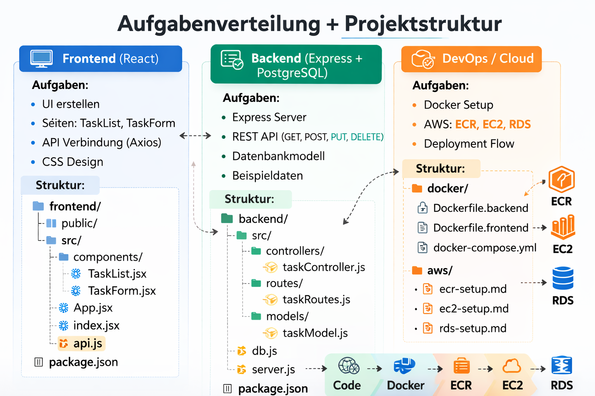

# Aufgabenverteilung + Basis Projektstruktur

## **Frontend**

* Benutzeroberfläche mit **React** entwerfen
* Grundstruktur der Seiten erstellen: Aufgabenliste, Aufgabe hinzufügen, Aufgabe löschen
* Verbindung zur Backend API vorbereiten (Fetch / Axios)
* Einfache CSS-Gestaltung für Demo

**Beispiel Ordnerstruktur:**

```
frontend/
│-- public/
│   │-- index.html
│-- src/
│   │-- components/
│   │   │-- TaskList.jsx
│   │   │-- TaskForm.jsx
│   │-- App.jsx
│   │-- index.jsx
│   │-- api.js       # API-Aufrufe
│-- package.json
```

---

## **Backend**

* **Express Server** aufsetzen
* REST API Endpoints planen: `GET /tasks`, `POST /tasks`, `PUT /tasks/:id`, `DELETE /tasks/:id`
* Datenbankmodell für **PostgreSQL** vorbereiten
* Beispiel-Daten für Testzwecke erstellen

**Beispiel Ordnerstruktur:**

```
backend/
│-- src/
│   │-- controllers/
│   │   │-- taskController.js
│   │-- routes/
│   │   │-- taskRoutes.js
│   │-- models/
│   │   │-- taskModel.js
│   │-- db.js          # Datenbankverbindung
│   │-- server.js
│-- package.json
```

---

## **DevOps / Cloud**

* Docker-Setup planen (Backend & optional Frontend)
* AWS Infrastruktur planen:

  * **ECR** für Docker Images
  * **EC2** für Deployment
  * **RDS** für Datenbank
* Deployment-Flow skizzieren (Image bauen → ECR → EC2 → Container starten)

**Beispiel Ordnerstruktur für Docker/Deployment:**

```
docker/
│-- Dockerfile.backend
│-- Dockerfile.frontend   # optional
│-- docker-compose.yml
│-- README.md
```

# Projektübersicht

Hier ist das Architekturdiagramm des Full-Stack Projekts:



Und hier die Rollenverteilung + Basis Projektstruktur:


